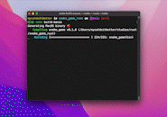

<div align="center">

## Snake Game 🐍

A simple snake game built with Rust and [Piston](https://www.piston.rs/).

The objective of the project is practice Rust, so the code are in current development. Feel free to contribute and sharing your knowledge to we improve this code together and built something cool!
<hr/>
<br/>



</div>

<br/>
<hr/>
<br/>


**Run it!**

To run the game, you need to have [Rust](https://www.rust-lang.org/tools/install) installed in your machine. After that, just run the following command:

```bash
  $ cargo run
```
Easy as that!

If you want to explore more, please take a look to the [makefile](./makefile), there are some useful commands to help you on build.


<br />

**Give me a feedback!**

If you test this code, please, give me a feedback about your experience. I would like to know if you liked! If you have any suggestions or if you found any bugs. I'm open to any kind of feedback, so don't be shy! 😁


<br/>

**We are work in progress! Some features that i want to implement:**

⏯ Add the possibility to pause the game <br/>
🍎 Show the score<br/>
🔒 Just close the game with confirmation<br/>
📦 Build versions to Windows, Linux and Mac.


